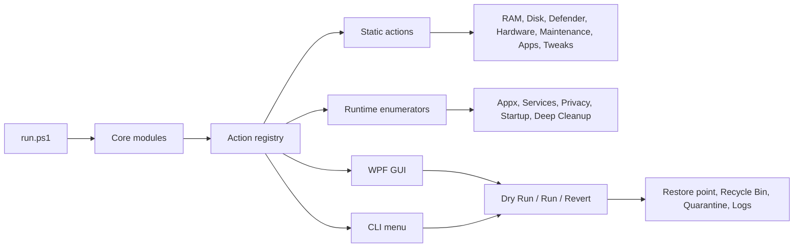

<div align="center">

# win10tools

**A cautious Windows 10 control panel for cleanup, diagnostics, privacy, services, apps, and system tweaks.**

`win10tools` is a personal PowerShell project that turns common Windows maintenance tasks into explicit, reviewable actions. It favors runtime discovery, dry-run previews, risk labels, and rollback paths over aggressive one-click presets.

[](https://github.com/0xRnato/win10tools/actions/workflows/ci.yml)
[](./LICENSE)


[Overview](#overview) . [Features](#features) . [Safety](#safety-model) . [Architecture](#architecture) . [Quickstart](#quickstart) . [Testing](#testing)

</div>

---

## Overview

Most Windows cleanup and debloat scripts are built around broad presets: disable many services, remove many packages, apply many registry tweaks, and hope the machine still behaves correctly afterwards.

`win10tools` takes a different approach. It inspects the current machine, builds a live action registry, and lets the user review each item before anything runs. Every action is unchecked by default, every action has a risk label, and destructive batches go through safety checks such as dry-run previews, restore points, Recycle Bin deletion, quarantine, and revert scriptblocks where the change is reversible.

The project is designed as a portfolio-grade Windows automation tool: practical, testable, cautious, and built with native Windows technology.

## Current Status

The main feature set is implemented through milestone M10. The remaining work is release validation on a clean Windows 10 VM and portfolio polish.

- **12 action categories**: `Debloat`, `RAM`, `Disk`, `Deep Cleanup`, `Defender`, `Hardware`, `Maintenance`, `Apps`, `Startup`, `Services`, `Privacy`, and `Tweaks`.
- **Runtime action registry** shared by GUI and CLI.
- **WPF desktop UI** for tabbed action review and execution.
- **CLI fallback** for terminal-only sessions.
- **One-line bootstrap** through `iwr | iex`.
- **229 unit tests + 3 integration tests** in Pester.
- **PSScriptAnalyzer + Pester CI** on GitHub Actions.
- **No telemetry, analytics, update pings, or paid services.**

## Features

| Area | What it covers |
|---|---|
| **Debloat** | Runtime-enumerated Appx and provisioned packages with `SAFE`, `MINOR`, and `AVOID` risk labels. |
| **RAM** | Working-set trim and standby-list purge actions. |
| **Disk** | Temp files, crash dumps, Windows Update cache, thumbnail cache, Delivery Optimization cache, browser caches, Recycle Bin, and `cleanmgr`. |
| **Deep Cleanup** | Stale files, unused apps, leftover folders, orphaned registry traces, and dead shortcuts. |
| **Defender** | Quick scan, full scan, signature update, Defender status, and threat history. |
| **Hardware** | SMART health, memory diagnostics, scheduled disk check, battery report, `dxdiag`, event-log triage, and optional CPU temperature readout. |
| **Maintenance** | `sfc`, DISM health checks, DISM repair, manual restore point, and scheduled quarantine cleanup. |
| **Apps** | `winget` bulk install groups and `winget export` backup. |
| **Startup** | Registry Run keys, Startup folder shortcuts, and scheduled tasks triggered at logon/startup. |
| **Services** | Short curated list of services that are generally safe to review, with full revert support. |
| **Privacy** | Reversible Windows privacy toggles for telemetry, advertising ID, activity history, Cortana, location, feedback, speech, typing, and related settings. |
| **Tweaks** | Power plan, DNS providers, DNS flush, Winsock reset, Explorer settings, and taskbar settings. |

## Safety Model

Safety is the central design constraint of the project.

- **Unchecked by default.** No action is selected automatically.
- **Dry Run before Run.** The user can inspect paths, commands, registry keys, and expected effects before applying a change.
- **Risk labels everywhere.** Actions are classified as `SAFE`, `MINOR`, or `AVOID`.
- **AVOID double-confirmation.** Risky actions require an explicit confirmation flow.
- **Restore points.** Destructive batches call the restore-point helper before execution.
- **Recycle Bin default.** File deletion uses the Recycle Bin unless direct delete is explicitly selected.
- **30-day quarantine.** Leftover cleanup moves residue to `%LOCALAPPDATA%\win10tools\quarantine`.
- **Revert support.** Reversible actions carry a `Revert` scriptblock.
- **Structured logs.** JSONL logs are written under `%LOCALAPPDATA%\win10tools\logs`.
- **Zero telemetry.** The tool does not phone home.

## Architecture



Every feature is represented as an action hashtable:

```powershell
@{
    Id            = 'category.action-name'
    Category      = 'Debloat'
    Name          = 'Human-readable action name'
    Description   = 'What this action does'
    Risk          = 'Safe' # Safe | Minor | Avoid
    Destructive   = $false
    NeedsReboot   = $false
    NeedsAdmin    = $true
    Context       = @{ }
    Check         = { param($c) $false }
    Invoke        = { param($c) }
    Revert        = { param($c) }
    DryRunSummary = { param($c) 'Preview text' }
}
```

Static actions live under `src/actions/`. Runtime-enumerated actions live under `src/enumerators/`. Both front-ends consume the same registry, so GUI and CLI behavior stays consistent.

## Project Structure

```text
win10tools/
|-- run.ps1
|-- src/
|   |-- core/
|   |   |-- bootstrap.ps1
|   |   |-- deletion.ps1
|   |   |-- elevation.ps1
|   |   |-- logger.ps1
|   |   |-- quarantine.ps1
|   |   |-- registry.ps1
|   |   |-- restore-point.ps1
|   |   |-- risk-table.ps1
|   |   `-- runner.ps1
|   |-- actions/
|   |   |-- apps.ps1
|   |   |-- defender.ps1
|   |   |-- disk.ps1
|   |   |-- hardware.ps1
|   |   |-- maintenance.ps1
|   |   |-- ram.ps1
|   |   `-- tweaks.ps1
|   |-- enumerators/
|   |   |-- appx.ps1
|   |   |-- leftover.ps1
|   |   |-- privacy.ps1
|   |   |-- services.ps1
|   |   |-- stale-apps.ps1
|   |   |-- stale-files.ps1
|   |   `-- startup.ps1
|   |-- ui/
|   |   |-- avoid-confirm.xaml
|   |   |-- main-window-helpers.ps1
|   |   |-- main-window.ps1
|   |   `-- main-window.xaml
|   `-- cli/
|       |-- menu-helpers.ps1
|       `-- menu.ps1
|-- tests/
|   |-- unit/
|   |-- integration/
|   `-- Invoke-Tests.ps1
|-- .github/workflows/ci.yml
|-- PSScriptAnalyzerSettings.psd1
|-- README.md
`-- LICENSE
```

## Quickstart

> Important: this project contains destructive actions. Review every Dry Run carefully and prefer testing in a disposable VM first.

Open **PowerShell as Administrator** and run:

```powershell
Set-ExecutionPolicy Bypass -Scope Process -Force
iwr -useb https://raw.githubusercontent.com/0xRnato/win10tools/main/run.ps1 | iex
```

Or clone and run locally:

```powershell
git clone https://github.com/0xRnato/win10tools.git
cd win10tools
.\run.ps1
.\run.ps1 -Cli
```

Use `-SkipElevation` only for inspection/debugging flows that should not perform privileged actions:

```powershell
.\run.ps1 -SkipElevation
```

## Requirements

- Windows 10 22H2 as the primary target.
- Windows 11 best-effort.
- PowerShell 5.1 or PowerShell 7.x.
- Administrator rights for most system actions.
- `winget` in PATH for app install/export actions.

## Testing

Install test dependencies:

```powershell
Set-PSRepository -Name PSGallery -InstallationPolicy Trusted
Install-Module Pester -MinimumVersion 5.5.0 -Force -SkipPublisherCheck -Scope CurrentUser
Install-Module PSScriptAnalyzer -Force -AllowClobber -Scope CurrentUser
```

Run tests:

```powershell
.\tests\Invoke-Tests.ps1
.\tests\Invoke-Tests.ps1 -Integration
.\tests\Invoke-Tests.ps1 -All
.\tests\Invoke-Tests.ps1 -All -Coverage
```

Run lint:

```powershell
Invoke-ScriptAnalyzer -Path . -Recurse -Settings .\PSScriptAnalyzerSettings.psd1
```

CI runs PSScriptAnalyzer and the unit suite on `windows-latest`.

## Release Checklist

Before publishing a release:

- Run unit tests and integration tests on a non-production machine.
- Run the bootstrap flow on a clean Windows 10 VM snapshot.
- Confirm GUI and CLI open correctly.
- Confirm Dry Run output for every category.
- Test destructive actions only in a disposable VM.
- Confirm AVOID confirmation, restore-point behavior, quarantine, logs, and revert flows.
- Create a version tag and GitHub release after validation.

## Development Notes

- Code, comments, commits, and documentation are written in English.
- Commit messages follow Conventional Commits: `type(scope): subject`.
- Prefer runtime enumeration over hard-coded bulk presets.
- Keep every destructive action opt-in, previewable, risk-labeled, and reversible where possible.
- PowerShell scripts stay ASCII-only for PowerShell 5.1 compatibility.

## References

This project is inspired by, and intentionally more conservative than:

- [christitustech/winutil](https://github.com/christitustech/winutil)
- [LeDragoX/Win-Debloat-Tools](https://github.com/LeDragoX/Win-Debloat-Tools)

## License

MIT. See [LICENSE](./LICENSE).
