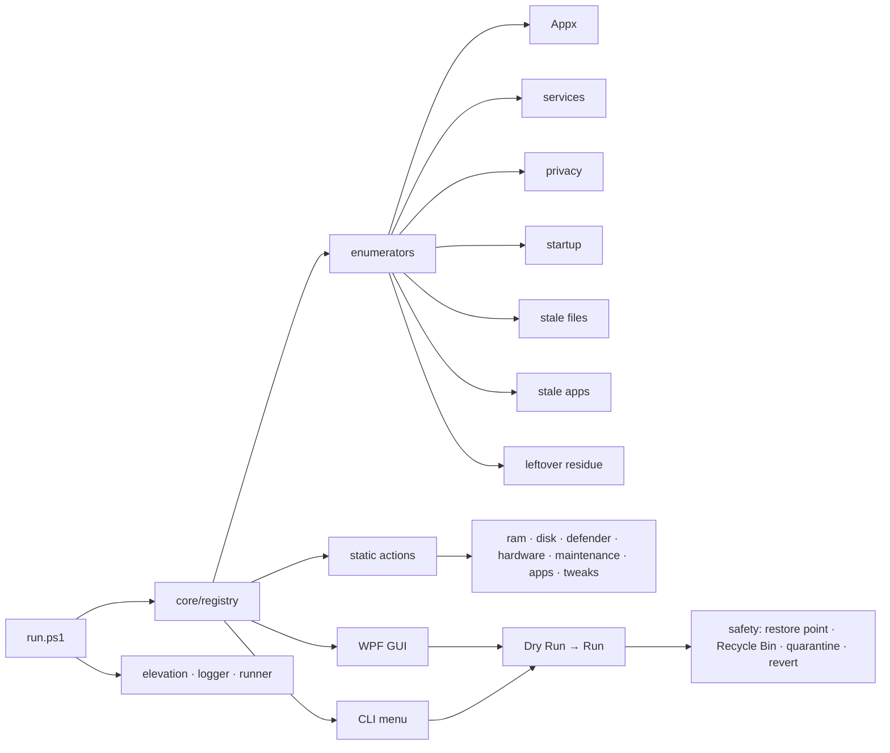

<div align="center">

# win10tools

**A Windows 10 control panel you actually trust — every change is explicit, reversible, and risk-labeled.**

Runtime-enumerated debloat, deep cleanup, Defender scans, hardware diagnostics, privacy and network tweaks.
Nothing runs unless you tick it. Nothing ships with aggressive presets. Nothing phones home.

[](https://github.com/0xRnato/win10tools/actions/workflows/ci.yml)
[](./LICENSE)


[Quickstart](#quickstart) · [Features](#feature-areas) · [Architecture](#architecture) · [Safety model](#safety-model) · [Testing](#testing) · [Development](#development)

</div>

---

## Why win10tools

Most Windows cleanup / debloat scripts ship large opinionated presets. They disable a long list of services, rip out Edge and OneDrive, flatten Xbox components, and overwrite the hosts file — in one click. Six weeks later something starts misbehaving and you can't tell which tweak did it.

`win10tools` takes the opposite approach:

- **Runtime enumeration, not hard-coded lists.** The tool inspects the live system and shows you what is actually installed / running. Every item is a row you decide on.
- **Risk labels and double-confirm gates.** Each action is tagged `SAFE`, `MINOR`, or `AVOID`. Items that historically break machines (Xbox services, Edge / EdgeWebView, Windows Search, Cortana, system audio / spooler, the Store) are shown but require an explicit double-confirm.
- **Dry Run first.** You see the exact paths, commands, and registry keys touched before anything runs.
- **Recycle Bin + quarantine + restore point.** Deletions go to the Recycle Bin by default; leftover residue operations quarantine for 30 days; a restore point is created before any destructive batch.
- **Zero telemetry.** Nothing calls home. No update ping. No analytics.

## Status

Usable end-to-end (milestones M1–M10):

- **12 categories** registered at runtime: `Debloat`, `RAM`, `Disk`, `Deep Cleanup`, `Defender`, `Hardware`, `Maintenance`, `Apps`, `Startup`, `Services`, `Privacy`, `Tweaks`.
- **~168 actions** enumerated on a typical Windows 10 Pro install (count varies with installed Appx packages, services, and startup entries).
- **WPF GUI** (M7) and **CLI menu** (M8) both consume the same registry.
- **`iwr | iex` bootstrap** (M9) downloads a zipball, extracts it to `%TEMP%`, and hands off to the local `run.ps1`.
- **Test suite**: 228 unit tests + 3 integration tests, PSScriptAnalyzer clean, CI on `windows-latest`.
- **Scheduled quarantine cleanup** (optional action) — registers a daily 03:00 Windows task that prunes quarantine batches older than 30 days.
- **In-app help** — `Help` button in the GUI (renders a quick-start card in the output panel) and `?` command in the CLI.

## Architecture



Every feature is a hashtable action in one registry. Both front-ends consume the same registry, so GUI and CLI behave identically.

### Action contract

```powershell
@{
    Id            = 'category.action-name'
    Category      = 'Debloat' | 'RAM' | 'Disk' | 'Deep Cleanup' | 'Defender' | 'Hardware' | 'Maintenance' | 'Apps' | 'Privacy' | 'Services' | 'Startup' | 'Tweaks'
    Name          = '<human label>'
    Description   = '<what it does>'
    Risk          = 'Safe' | 'Minor' | 'Avoid'
    Destructive   = $true | $false
    NeedsReboot   = $true | $false
    NeedsAdmin    = $true | $false
    Context       = @{ ... }
    Check         = { param($c) <returns $true if already applied> }
    Invoke        = { param($c) <apply> }
    Revert        = { param($c) <revert, or $null> }
    DryRunSummary = { param($c) <short preview string> }
}
```

## Feature areas

| Area | What it covers |
|---|---|
| **Debloat** | Runtime-enumerated Appx + provisioned packages with risk badges (AVOID for Xbox / Edge / Store / Search / Photos / OneDrive / runtime packages; MINOR for user-affecting Microsoft apps; SAFE for third-party stubs) |
| **RAM** | Working-set trim (`psapi!EmptyWorkingSet`) and standby list purge (`ntdll!NtSetSystemInformation`, `SystemMemoryListInformation`) |
| **Disk (surface)** | `cleanmgr /sagerun:1`, temp / crash / Windows-Update / thumbnail / delivery-optimization caches, per-browser caches (Chrome/Edge/Firefox/Brave), Recycle Bin |
| **Deep Cleanup** | Stale files by last-touched time (threshold configurable, default 90 days), unused apps (Prefetch cross-ref), leftover residue (orphaned AppData / ProgramFiles / ProgramData + dead shortcuts + fuzzy publisher match) |
| **Defender** | Quick / Full scan, `Update-MpSignature`, computer status + threat history |
| **Hardware** | SMART health, scheduled `mdsched` / `chkdsk` at next boot, battery report (`powercfg /batteryreport`), `dxdiag`, 24-hour event log triage, optional ACPI CPU temperature |
| **Maintenance** | `sfc /scannow`, `DISM /CheckHealth`, `DISM /RestoreHealth`, manual restore point |
| **Apps** | `winget` bulk installer from a declarative manifest (dev / media / utils / browser / runtime categories) + `winget export` backup |
| **Privacy** | 11 per-toggle registry changes (telemetry minimum, advertising ID, activity history, tailored experiences, typing insights, inking, speech cloud, feedback frequency, Cortana, location tracking) |
| **Services** | Curated short list of genuinely safe-to-disable services (`DiagTrack`, `dmwappushservice`, `RetailDemo`, `MapsBroker`, `PcaSvc`, `Fax`, `WbioSrvc` with warning) — never touches audio / spooler / WSearch / core stack |
| **Startup** | Registry Run keys + StartupApproved bytes, Startup folder `.lnk` files, scheduled tasks with AtLogon / AtStartup triggers — toggle with full revert |
| **Tweaks** | Ultimate Performance power plan, DNS switcher (Cloudflare / Google / AdGuard / Quad9), flush DNS, Winsock reset, Explorer / taskbar (dark mode, file extensions, hidden files, small search, hide Task View / People) |

## Quickstart

Open **PowerShell as Administrator** and run one of the following.

### Remote bootstrap (one-liner)

```powershell
Set-ExecutionPolicy Bypass -Scope Process -Force
iwr -useb https://raw.githubusercontent.com/0xRnato/win10tools/main/run.ps1 | iex
```

This downloads `run.ps1`, which then fetches the full zipball from GitHub, extracts it under `%TEMP%\win10tools-<timestamp>\`, and hands off to the extracted copy. From there every module under `src/` is dot-sourced and the WPF window opens (or the CLI menu if you pass `-Cli` later).

### Clone and run locally

```powershell
git clone https://github.com/0xRnato/win10tools.git
cd win10tools
.\run.ps1                    # WPF GUI
.\run.ps1 -Cli               # CLI menu
.\run.ps1 -SkipElevation     # load registry without elevating (for inspection / debugging)
```

### Drive actions directly from PowerShell (advanced)

```powershell
# load everything without running the script end-to-end
$srcRoot = 'C:\Users\<you>\win10tools\src'
foreach ($d in 'core','enumerators','actions') {
    Get-ChildItem (Join-Path $srcRoot $d) -Filter '*.ps1' | ForEach-Object { . $_.FullName }
}
Initialize-W10Logger
Invoke-AllEnumerators

# inspect what got registered
Get-ActionCategories
@(Get-Actions -Category 'Debloat' -Risk 'Safe') | Select-Object Id, Name

# preview one without touching the system
$action = Get-Action -Id 'ram.trim-working-sets'
Invoke-Action -Action $action -DryRun

# run it for real
Invoke-Action -Action $action
```

### Requirements

- Windows 10 22H2 (primary target). Windows 11 best-effort.
- PowerShell 5.1 (shipped with Windows) or PowerShell 7.x.
- Administrator rights for most actions — the entry script re-launches elevated if you forget.
- `winget` in PATH if you plan to use the bulk-install actions (ships with Windows 10 21H2+).

## Safety model

- **Default unchecked.** Nothing runs unless you tick it.
- **Dry Run → Run.** Every action has a `DryRunSummary` scriptblock; the runner uses it when `-DryRun` is set.
- **Risk badges.** `SAFE` / `MINOR` / `AVOID` surfaced in every action hashtable.
- **AVOID double-confirm.** The GUI (M7) will modal-confirm every AVOID action before proceeding.
- **Restore point.** `Invoke-ActionBatch` calls `New-AutoRestorePoint` once per batch containing `Destructive=$true` actions (rate-limited to 1 per 24h per Windows default).
- **Recycle Bin.** `Remove-ItemSafely` uses `Microsoft.VisualBasic.FileIO.FileSystem::DeleteFile` with `SendToRecycleBin` by default; direct delete is an explicit toggle via `Set-DeletionMode Direct`.
- **Quarantine.** The leftover residue module stashes moved items / exported registry keys in `%LOCALAPPDATA%\win10tools\quarantine\<timestamp>\` for 30 days (`Remove-OldQuarantine` prunes older).
- **Revert.** Services, privacy toggles, hosts file edits, DNS switcher, power plan, and Explorer tweaks all register a `Revert` scriptblock that restores the previous state.
- **Logs.** Structured JSONL at `%LOCALAPPDATA%\win10tools\logs\YYYY-MM-DD.log`. Each line is a JSON object: `{ts, session, level, msg, actionId?, data?}`.

Example log line:

```json
{"ts":"2026-04-20T17:32:24.18-03:00","session":"1b937ee7","level":"Info","msg":"applied","actionId":"ram.trim-working-sets"}
```

## Project structure

```
win10tools/
├── run.ps1                       # entry point; dot-sources everything, elevates, invokes enumerators
├── src/
│   ├── core/
│   │   ├── registry.ps1          # Register-Action, Get-Actions, Invoke-AllEnumerators, Clear-Actions
│   │   ├── risk-table.ps1        # Get-AppxRisk + AVOID/MINOR pattern tables
│   │   ├── elevation.ps1         # Test-IsAdmin, Assert-Admin, Invoke-Elevate
│   │   ├── logger.ps1            # Initialize-W10Logger, Write-W10Log (JSONL), Get-W10LogPath
│   │   ├── runner.ps1            # Invoke-Action, Invoke-ActionBatch, Invoke-ActionRevert, Get-ActionDryRun
│   │   ├── deletion.ps1          # Remove-ItemSafely (Recycle / Direct), Set-DeletionMode
│   │   ├── quarantine.ps1        # New-QuarantineBatch, Move-ToQuarantine, Export-RegistryKeyToQuarantine
│   │   └── restore-point.ps1     # New-AutoRestorePoint (rate-limit aware), Get-LatestRestorePoint
│   ├── enumerators/
│   │   ├── appx.ps1              # Appx + provisioned debloat candidates with risk hints
│   │   ├── services.ps1          # Curated safe-to-tweak services (short allowlist)
│   │   ├── privacy.ps1           # 11 privacy-related registry toggles
│   │   ├── startup.ps1           # Run keys, Startup folder, scheduled tasks (AtLogon/AtStartup)
│   │   ├── stale-files.ps1       # Invoke-StaleFilesScan + user-folder and AppData scans
│   │   ├── stale-apps.ps1        # Get-InstalledProgramIndex + Get-PrefetchIndex cross-ref
│   │   └── leftover.ps1          # Orphaned folder/registry/shortcut detection with confidence levels
│   ├── actions/
│   │   ├── ram.ps1               # EmptyWorkingSet + standby list purge
│   │   ├── disk.ps1              # cleanmgr preset, temp/cache wipers, per-browser cache
│   │   ├── defender.ps1          # scans, signature update, status, threat history
│   │   ├── hardware.ps1          # SMART, mdsched, chkdsk, battery, dxdiag, event log, CPU temp
│   │   ├── maintenance.ps1       # sfc, DISM CheckHealth + RestoreHealth, restore point
│   │   ├── apps.ps1              # winget bulk install + export
│   │   └── tweaks.ps1            # power plan, DNS switcher, Winsock, Explorer tweaks
│   ├── ui/                       # (M7) WPF XAML + bindings
│   └── cli/                      # (M8) numbered menu
├── tests/
│   ├── unit/                     # Pester 5 unit tests (one file per module)
│   ├── integration/              # tagged Integration (loader smoke)
│   └── Invoke-Tests.ps1          # local runner (-Integration, -All, -Coverage)
├── .github/workflows/ci.yml      # PSScriptAnalyzer + Pester on windows-latest
├── PSScriptAnalyzerSettings.psd1 # central lint config
├── README.md
└── LICENSE
```

## Testing

The test suite is Pester 5 + PSScriptAnalyzer, both run locally and in CI.

### Install the prerequisites (one-time)

```powershell
Set-PSRepository -Name PSGallery -InstallationPolicy Trusted
Install-Module Pester           -MinimumVersion 5.5.0 -Force -SkipPublisherCheck -Scope CurrentUser
Install-Module PSScriptAnalyzer -Force -AllowClobber -Scope CurrentUser
```

### Run the unit suite

```powershell
.\tests\Invoke-Tests.ps1                    # unit only (excludes Integration tag)
.\tests\Invoke-Tests.ps1 -Integration       # integration only (hits run.ps1 subprocess)
.\tests\Invoke-Tests.ps1 -All               # everything
.\tests\Invoke-Tests.ps1 -All -Coverage     # + code coverage report
```

Results are written to `TestResults.xml` (NUnit-compatible) and `Coverage.xml` (when `-Coverage` is used). Both are `.gitignore`d.

### Lint

```powershell
Invoke-ScriptAnalyzer -Path . -Recurse -Settings .\PSScriptAnalyzerSettings.psd1
```

The settings file excludes the four noisy-but-intentional rules: `PSAvoidUsingWriteHost`, `PSUseShouldProcessForStateChangingFunctions`, `PSAvoidUsingInvokeExpression`, and `PSUseSingularNouns`.

### CI

GitHub Actions runs the analyzer then Pester on every push and pull request to `main`, on a `windows-latest` runner. The workflow is at [`.github/workflows/ci.yml`](.github/workflows/ci.yml); the Pester results XML is uploaded as an artifact on every run.

## Development

### Adding a new action

1. Pick the right module: static actions live under `src/actions/<area>.ps1`, runtime-enumerated lists under `src/enumerators/<source>.ps1`.
2. Define a `Register-<Something>Actions` function that calls `Register-Action @{ ... }` for each action, honouring the [action contract](#action-contract).
3. Call `Register-Enumerator 'Register-<Something>Actions'` at the bottom of the file so `Invoke-AllEnumerators` picks it up automatically.
4. Add a `tests/unit/<module>.Tests.ps1` covering registration, required fields, and at least one dry-run summary format check.
5. Run `.\tests\Invoke-Tests.ps1` and `Invoke-ScriptAnalyzer -Path . -Recurse -Settings .\PSScriptAnalyzerSettings.psd1` before you commit.

### Ground rules

- Language: English in all code, commits, comments, and documentation.
- Conventional Commits: `type(scope): subject`. Scope `kebab-case`. Subject lowercase, imperative, ≤72 chars, no trailing period.
- One commit = one thing describable in a sentence.
- Don't ship hard-coded bulk presets — add an enumerator or a single opt-in action.
- Every destructive action must register `Check`, `Invoke`, and (where reversible) `Revert`.
- `.ps1` files stay **ASCII-only** — PowerShell 5.1 reads non-BOM files as the Windows ANSI codepage and will corrupt UTF-8 multi-byte characters.

## Inspired by (and deliberately different from)

- [christitustech/winutil](https://github.com/christitustech/winutil)
- [LeDragoX/Win-Debloat-Tools](https://github.com/LeDragoX/Win-Debloat-Tools)

Both are excellent references. The key departures here are: **no bulk presets**, **risk labels visible in every row**, **dry-run required first**, **restore point + quarantine safety net**, and **zero telemetry in the tool itself**.

## License

MIT — see [LICENSE](./LICENSE).
