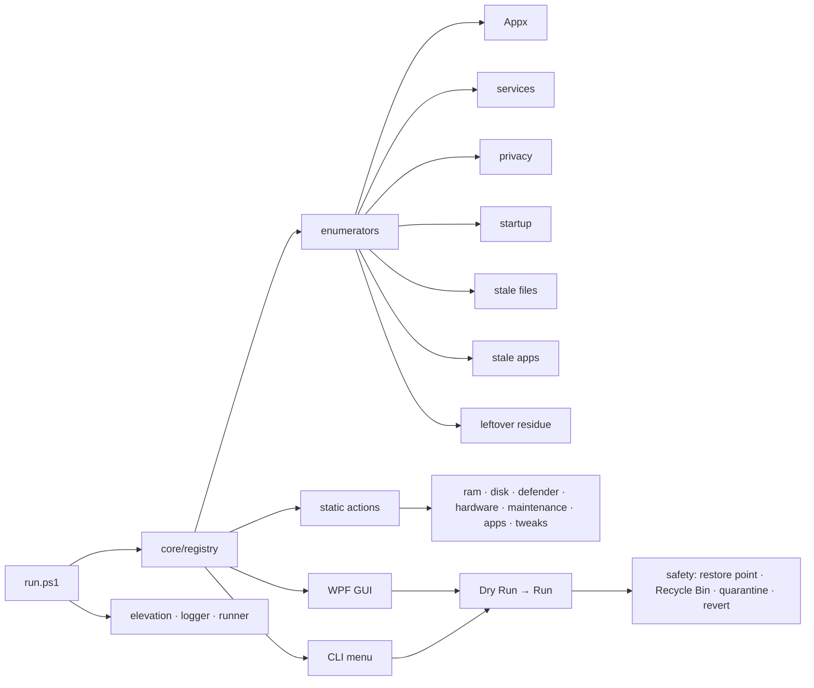

<div align="center">

# win10tools

**A Windows 10 control panel you actually trust — every change is explicit, reversible, and risk-labeled.**

Runtime-enumerated debloat, deep cleanup, Defender scans, hardware diagnostics, privacy and network tweaks.
Nothing runs unless you tick it. Nothing ships with aggressive presets. Nothing phones home.

[](./LICENSE)


[Quickstart](#quickstart) · [Features](#features) · [Architecture](#architecture) · [Safety model](#safety-model)

</div>

---

## Why win10tools

Most Windows cleanup / debloat scripts ship large opinionated presets. They disable a long list of services, rip out Edge and OneDrive, flatten Xbox components, and overwrite the hosts file — in one click. Six weeks later something starts misbehaving and you can't tell which tweak did it.

`win10tools` takes the opposite approach:

- **Runtime enumeration, not hard-coded lists.** The tool inspects the live system and shows you what is actually installed / running. Every item is a row you decide on.
- **Risk labels and double-confirm gates.** Each action is tagged `SAFE`, `MINOR`, or `AVOID`. Items that historically break machines (Xbox services, Edge / EdgeWebView, Windows Search, Cortana, system audio / spooler, the Store) are shown but require an explicit double-confirm.
- **Dry Run first.** You see the exact paths, commands, and registry keys touched before anything runs.
- **Recycle Bin + quarantine + restore point.** Deletions go to the Recycle Bin by default; leftover residue operations quarantine for 30 days; a restore point is created before any destructive batch.
- **Zero telemetry.** Nothing calls home. No update ping. No analytics.

## Status

Early development. Milestone M1 (core scaffold) in progress. See [PLAN.md](./PLAN.md) (local) for the full roadmap.

## Architecture



Every feature is a hashtable action in one registry. Both front-ends consume the same registry, so GUI and CLI behave identically.

## Feature areas

| Area | What it covers |
|---|---|
| **Debloat** | Runtime-enumerated Appx + provisioned packages with risk badges |
| **RAM** | Working-set trim + standby list / modified page list clear |
| **Disk (surface)** | `cleanmgr`, temp / cache / WU cache wipe, Recycle Bin |
| **Deep Cleanup** | Stale files (threshold), unused apps (Prefetch cross-ref), leftover residue (AppData / ProgramData / registry / scheduled tasks / dead shortcuts) |
| **Defender** | Quick / full / custom scan, signature update, status panel |
| **Hardware** | SMART, `mdsched`, `chkdsk`, battery report, `dxdiag`, event log triage |
| **Maintenance** | `sfc /scannow`, `DISM /RestoreHealth`, auto restore point |
| **Apps** | `winget` bulk installer from a declarative manifest |
| **Privacy** | Per-toggle telemetry / Cortana / activity history / ad ID / speech cloud switches |
| **Services** | Curated short list of safe-to-disable services + scheduled tasks |
| **Startup** | Registry / Startup folder / scheduled-task triggers toggle |
| **Tweaks** | Ultimate Performance power plan, DNS switcher, Winsock reset, Explorer / taskbar prefs |

## Quickstart

Open **PowerShell as Administrator**, then:

```powershell
Set-ExecutionPolicy Bypass -Scope Process -Force
iwr -useb https://raw.githubusercontent.com/<user>/win10tools/main/run.ps1 | iex
```

Or clone and run locally:

```powershell
git clone https://github.com/<user>/win10tools.git
cd win10tools
.\run.ps1            # GUI
.\run.ps1 -Cli       # numbered menu
```

Requirements:
- Windows 10 22H2 (primary target). Win11 best-effort.
- PowerShell 5.1 (shipped) or 7.x.
- Administrator rights for most actions (the tool re-launches elevated if needed).

## Safety model

- **Default unchecked.** Nothing runs unless you tick it.
- **Dry Run → Run.** You approve the preview.
- **Risk badges.** SAFE / MINOR / AVOID surfaced in every row.
- **AVOID double-confirm.** Modal lists every AVOID action before proceeding.
- **Restore point.** Auto-created before any batch with destructive actions (rate-limited to 1 per 24h per Windows default).
- **Recycle Bin.** Default for file deletion; direct delete is an explicit toggle.
- **Quarantine.** Leftover residue operations stash the removed paths / exported registry keys in `%LOCALAPPDATA%\win10tools\quarantine\<timestamp>\` for 30 days.
- **Revert.** Actions with reversible effects (services, privacy, hosts, DNS, power plan, Explorer) register a revert scriptblock.
- **Logs.** Structured JSONL at `%LOCALAPPDATA%\win10tools\logs\YYYY-MM-DD.log`.

## Project structure

```
src/
├── core/         # registry, elevation, logger, runner, deletion, quarantine, restore-point, risk-table
├── enumerators/  # dynamic actions sourced from live system state
├── actions/      # static actions (sfc, dism, winget, ram, disk, defender, hardware, tweaks)
├── ui/           # WPF XAML + bindings
└── cli/          # numbered menu fallback
```

## Contributing

- Language: English in all code, commits, comments, and documentation.
- Conventional Commits: `type(scope): subject`. Scope `kebab-case`. Subject lowercase, imperative, ≤72 chars, no trailing period.
- One commit = one thing describable in a sentence.
- Don't ship hard-coded presets — add an enumerator or an opt-in action.
- Every destructive action must register `Check`, `Invoke`, and (where reversible) `Revert`.

## License

MIT — see [LICENSE](./LICENSE).
